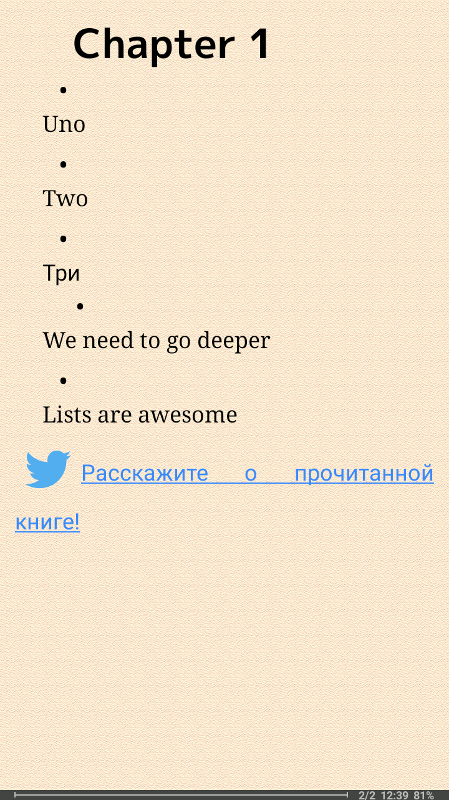

= asciidoctor-epub3 with list test

== To build epub

 . Run `./gradlew asciidoctorEpub`
 . Output file is `build/docs/asciidocEpub/asciidoc-test.epub`

== Bug description

Open `build/docs/asciidocEpub/asciidoc-test.epub` in https://fbreader.org/[FBReader].

For your convenience, generated epub file is available via https://github.com/slonopotamus/asciidoctor-epub3-lists-test/releases[Releases].

Expected: list item text starts on the same line as list item marker

Actual: there's a line break between list item marker and list item text.

Screenshot from the latest available FBReader for Android  (as of 2019-12-20):

